# Documentación Técnica: Preprocesamiento de Datos con Git y GitHub

**Autor:** Andrés Nevárez  
**Repositorio:** [preprocesamiento-ciencia-datos](https://github.com/AndyNeva/preprocesamiento-ciencia-datos.git)

## 1. Introducción y Objetivo

El presente proyecto tiene como objetivo demostrar la aplicación práctica de **Git y GitHub** para la gestión de versiones y la colaboración en entornos de Ciencia de Datos, así como la implementación de un pipeline de preprocesamiento y liempieza de datos utilizando Python y librerías como Pandas, Numpy, Scikit-learn, entre otras.
Se utilizó el dataset Heart Disease UCI, seleccionado por su relevancia clínica y la presencia de características típicas de datos reales, como ruido, duplicados y mezcla de tipos de variables. Este dataset fue obtenido de Kaggle y se puede obtener en el siguiente enlace.

**Dataset:** [Heart Disease Uci](https://www.kaggle.com/datasets/ketangangal/heart-disease-dataset-uci/data)

## 2. Funcionalidades Clave del Proyecto

Las funcionalidades clave implementadas en el archivo preprocesamiento.py se describen a continuación:

### 2.1. Limpieza Inicial y Duplicados
Se identificaron y eliminaron registros duplicados exactos. Durante esta etapa se descubrió que el dataset presentaba una alta tasa de redundancia (70,54%). Se decidió eliminar los registros duplicados ya que estos afectaban a la calidad de los datos y por lo tanto iban a comprometer los resultados del modelado. También se corrigieron los errores de digitación. Por ejemplo en la variable `thalassemia` existía la categoría "No", sin embargo esta categoría no es válida así que se procedió a convertirla en NA para ser tratada en los pasos posteriores.

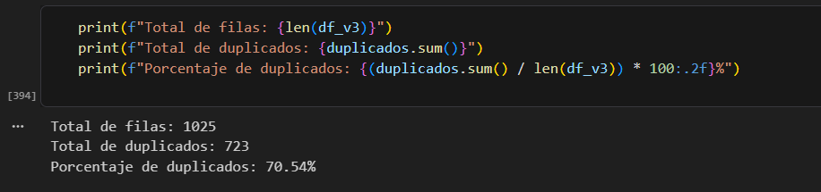

### 2.2. Manejo de Valores Atípicos (Outliers)
Se realizó un análisis de rangos clínicos para variables como `age`, `resting_blood_pressure` y `cholestoral`. Para esto, se utilizaron rangos establecidos por la bibliografía médica consultada. Luego de filtrar los datos en base a estos rangos, se determinó que los valores extremos presentes en el dataset (ej. colesterol > 400 mg/dl) son clínicamente posibles y representan casos patológicos relevantes. Por lo tanto, no se eliminaron, ya que en el ámbito de la salud, los casos extremos (pacientes enfermos) suelen ser más importantes que los promedios (pacientes sanos).

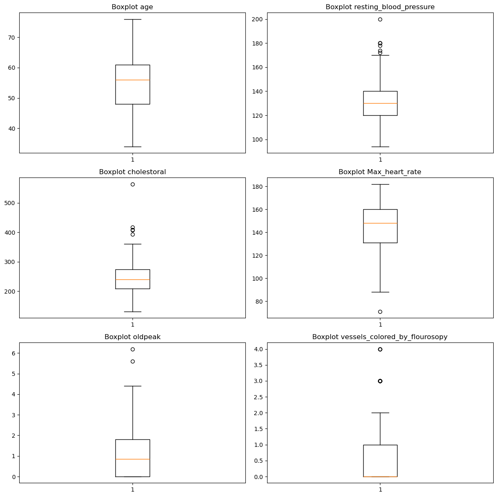

### 2.3. Manejo de nulos
Se imputaron los valores nulos (NA) encontrados en el dataset. Para el caso de las variables numéricas se utilizó la mediana y para las variables categóricas se utilizó la moda. Esto permitió eliminar los registros con valores de variables fuera de los límites clínicos y eliminar los errores de digitación.

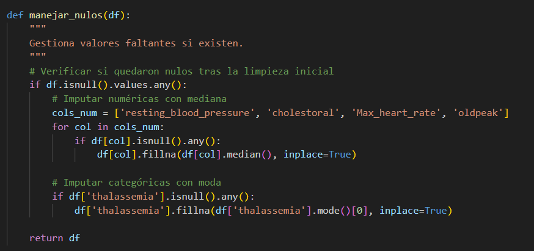

### 2.4. Codificación de Variables Categóricas
Se convirtieron las variables categóricas a númericas usando dos tipos de algoritmos. Para las variables ordinarias como `fasting_blood_sugar` se usó el *Label Encoding*. Por otro lado para las variables nominales como `sex`, `chest_pain_type`, etc; se utilizó el *One-Hot Encoding* mediante la función `pd.get_dummies`.

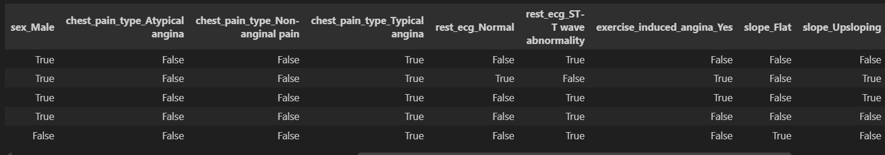

### 2.5. Normalización (Escalado)
Se aplicó *StandardScaler* a las variables numéricas continuas (`age`, `trestbps`, `chol`, `thalach`, `oldpeak`). Esto transforma los datos para que tengan media 0 y desviación estándar 1, evitando que variables con escalas mayores (como el colesterol) dominen el cálculo de distancias en futuros modelos.

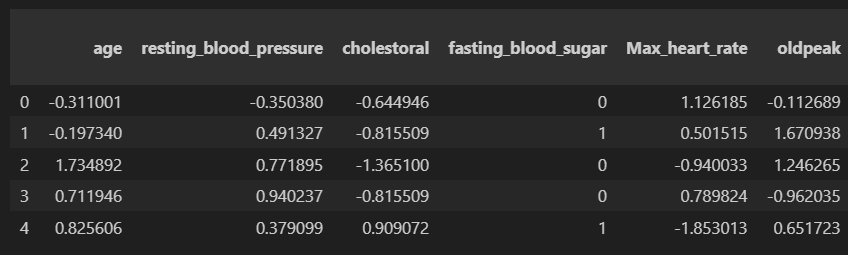
## 3. Comandos Git Utilizados

A continuación, se describen los comandos ejecutados durante el desarrollo del proyecto, junto con su propósito técnico.

### 3.1. Inicialización y Configuración
Se configuró el entorno local para vincularlo con el repositorio remoto y establecer la identidad del autor.

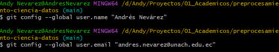

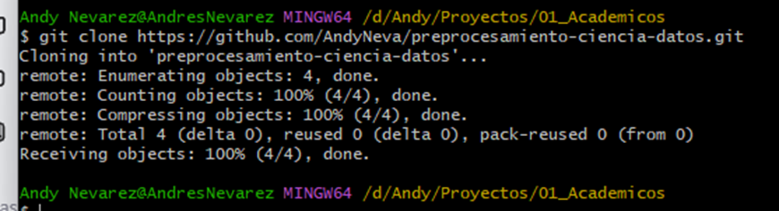

### 3.2. Gestión de Ramas (Branching) y Estructura del Proyecto
Se creó una rama de trabajo aislada (`feature-preprocesamiento`) para desarrollar el script de preprocesamiento sin afectar la rama principal (`main`). Esto permite trabajar de forma segura y organizada. 

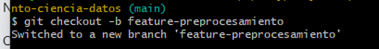
*Nota:* Se utilizó -b para que con un solo comando se cree la rama y se cambie a la nueva rama.

También se creó la estructura de carpetas (`data` y `notebooks`) y se agregó un archivo `.gitkeep` adentro para que la estructura del prooyecto se suba al repositorio remoto sin problemas

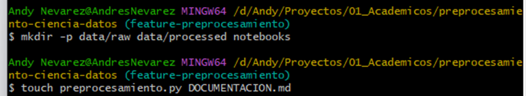
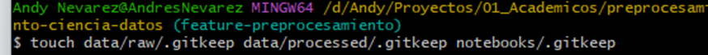

### 3.3. Commit y Push
Se registraron los cambios realizados en el notebook `eda_heartdisease.ipynb` y el script `preprocesamiento.py`, así como también en los archivos dentro de la estructura de carpetas. El mensaje del commit describe claramente la funcionalidad añadida. Se utilizó *feat* (feature) para cualquier funnción adicional que se agregó, *doc* (documentación) para la documentación y *ci* para la integración continua.

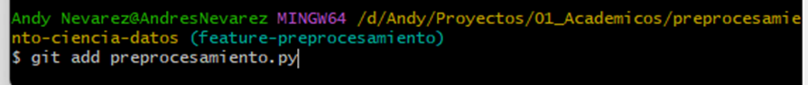
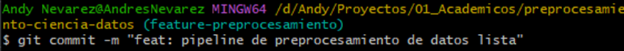

*Nota:* See utiliza -u para enlazar la rama de preprocesamiento local con la rama de preprocesamiento remota.

### 3.4. Pull Request y Fusión
Se solicitó la integración de los cambios desde la rama de característica hacia `main` mediante un *Pull Request*. Este paso simula un flujo de trabajo colaborativo donde el código es revisado antes de ser aceptado en la versión estable.

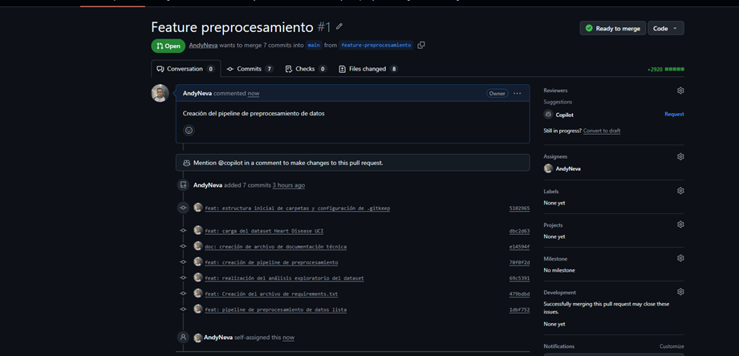
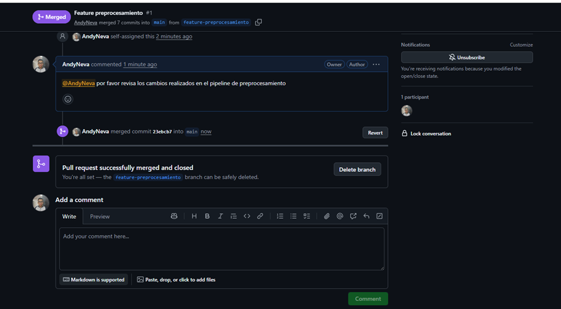

## 5. Automatización con GitHub Actions

Se configuró un workflow de Integración Continua (CI) en el archivo `.github/workflows/ci.yml`. Este pipeline se ejecuta automáticamente ante cada *Push* o *Pull Request* en la rama `main`.

**Funcionalidad del Workflow:**
1.  Configura un entorno Ubuntu con Python 3.10.
2.  Instala las dependencias listadas en `requirements.txt`.
3.  Ejecuta el script `preprocesamiento.py` para verificar que no existan errores de sintaxis o ejecución.

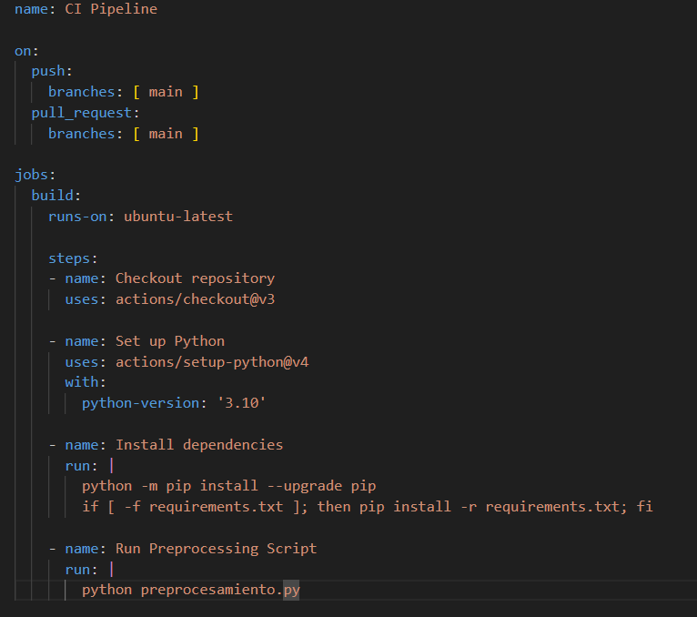

Esto garantiza que cualquier cambio futuro no rompa la funcionalidad básica del proyecto.

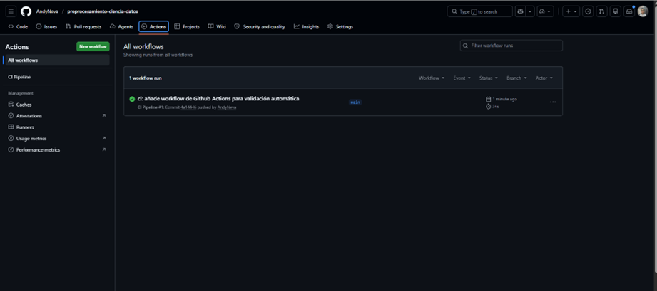

## 6. Conclusión

La implementación de este proyecto permitió consolidar el uso de Git para el control de versiones estructurado y la aplicación de técnicas de preprocesamiento de datos justificadas técnicamente. La separación de responsabilidades en funciones modulares y la automatización mediante CI/CD sientan las bases para un desarrollo escalable y profesional en entornos de Ciencia de datos.

